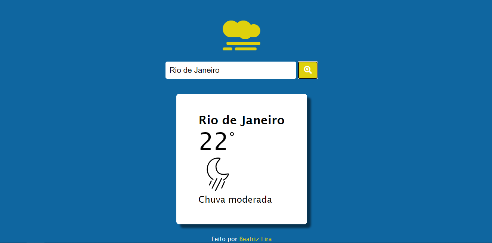

# Weather App 🌥
Aplicação para mostrar a previsão do tempo atual de acordo com a localização escolhida pelo usuário

## Layout 💻

## Ferramentas utilizadas 🛠
- HTML
- CSS
- JavaScript
- APi <a href="https://openweathermap.org/" target="_blank">OpenWeather </a>

#
- <a href="./LICENSE.md">Licença </a> 📃

Feito por <a href="http://linkedin.com/in/beatrizliragonzaga" target="_blank">Beatriz Lira</a> 🎈

